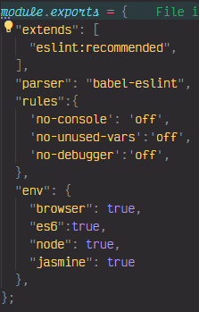
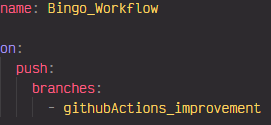
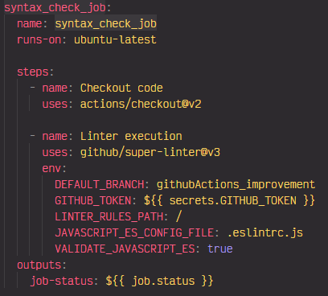
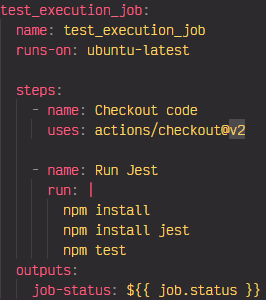
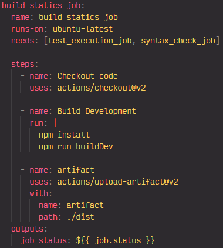
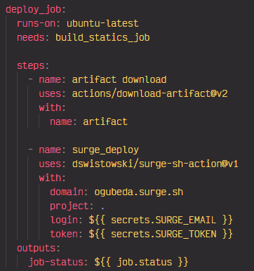
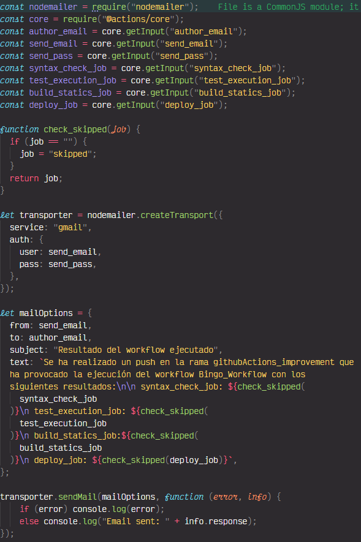
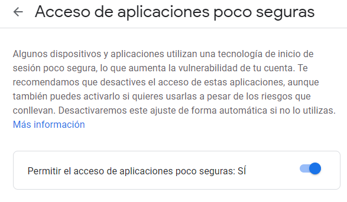
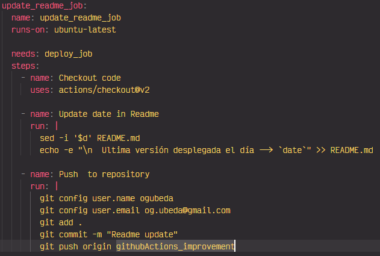

# Práctica de mejora Bingo Twingo con Github Actions

## Explicaciones

### Explicación Eslint

Su función és analizar el código de nuestra aplicación, detectar problemas por medio de patrones y si está a su alcance resolverlos el mismo.

### Explicación Jest

Jest es un framework desarrollado por Facebook, de tipo generalista que podemos utilizar en cualquier situación. Con el podremos construir tests unitarios trabajando con matchers personalizados, crear moks o comprobar snapshots de componentes visuales como algo sencillo y accesible.

### Explicación Surge SH

Surge SH es un generador de sitios estáticos, en el cual podemos crear un dominio de forma gratuita para visualizar una aplicación web.

## Parte práctica

### Creación del job linter

El primer paso será crear nuestro archivo `.eslintrc.js` donde especificaremos todos los patrones que tiene que seguir a la hora de comprobar el código.

Luego crearemos la estructura de directorios donde dejaremos nuestras actions personalizadas y nuestros workflows, la estructura será:
`.github/actions/email_action`
`.github/workflows`

Dentro del directorio workflows crearemos el archivo `bingo_workflow.yml` que es donde estableceremos todos los jobs de la práctica.

A este workflow le asignaremos el nombre `Bingo_Workflow` y se llevará a cabo al realizar un push en la rama *githubActions_improvement*.

Y crearemos el job `syntax_check_job`, que será el encargado de lanzar el linter.

El job quedará de esta forma:

También habrá que crear una variable secret en GitHub para no exponer nuestro token. Para ello dentro de nuestro repositorio de GitHub accederemos a los ajustes y luego a la parte de **Secrets**.

Dentro definiremos la variable `GITHUB_TOKEN` con nuestro token.

### Creación del job test

El job de test funcionará sobre Jest.

Para ello ejecutaremos los comandos necesarios para que realice las comprobaciones.

### Creación del job para generar estáticos

Este job generará los estáticos necesarios para despues desplegar la aplicación en Surge Sh, para ello lanzaremos los comandos necesarios para generarlos y a través de los artifacts los recuperaremos desde `/dist`.

### Creación del job de desplegamiento en Surge Sh

Primero crearemos el job para desplegar en Surge, para ello usaremos el *artifact* y crearemos un step donde lanzaremos el desplegamiento en Surge y en las variables de entorno haremos referencia al dominio que utilizaremos, el proyecto que desplegaremos y dos variables secretas de Github que crearemos después.

Una vez tengamos el job hecho iremos a Github y en la pestaña anterior, donde creamos la variable secreta anterior, crearemos una con el token de Surge, que se obtiene lanzando el comando `surge token` y el email asociado.

### Creación del job de envío de email

Esta vez empezaremos creando una action personalizada para el envío de emails. Dentro del directorio *email_action* iniciaremos un proyecto node con el comando `npm init`. Una vez finalizado instalaremos las librerías `@actions/core` y `nodemailer`:

`npm install --save @actions/core` y `npm install --save nodemailer`

Luego crearemos el fichero index.js donde esribiremos el código para enviar el email.

Y procederemos a crear el job en el workflow, en este habrá que definir otras tres variables secretas de Github: *AUTHOR_EMAIL, SEND_EMAIL, SEND_PASS*.
En la cuenta de Gmail que utilizemos habrá que habilitar el parámetro **Acceso de aplicaciones poco seguras**.

### Creación del job de actualización de Readme

Para este job lanzaremos un comando que reescribirá el Readme y lo subirá automáticamente a Github.

